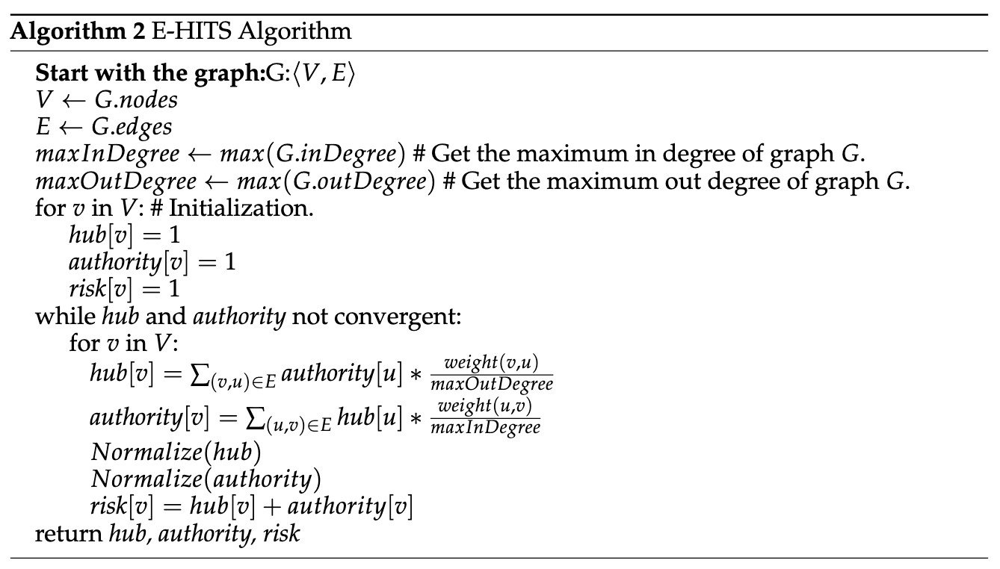

# Identity Ecosystem Graph Construction and Risk Calculation
### Below shows an example connection of PII related attributes in the Identity Ecosystem Graph

### There are two ways for risk calculation: The PageRank Algorithm, and the E-HITS (edge weight hyperlink-induced topic search) Algorithm.

Regarding the code to the Identity Ecosystem Graph construction with an eample dataset and the code to the risk calculation algorithms, please refer to the github repository at https://github.com/niu-haoran/vlm-privacy.git.
